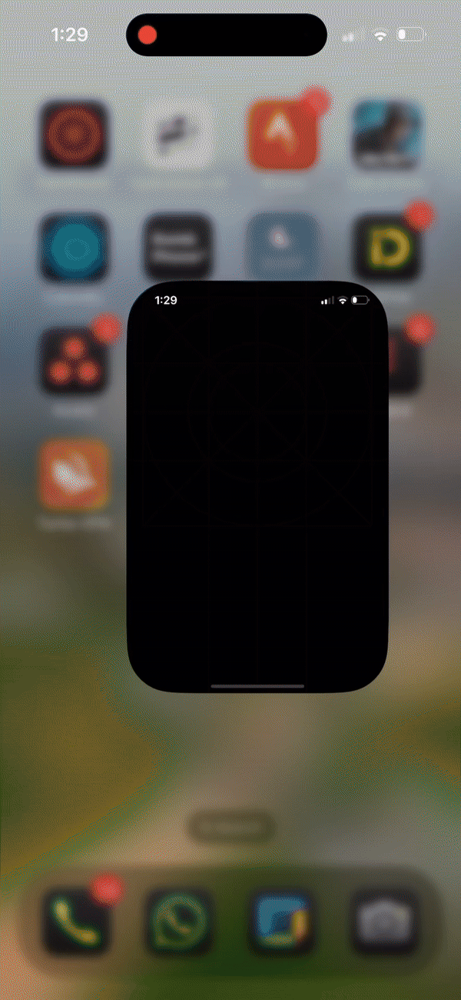

# Voyant
<p align="left">
  <a href="https://github.com/Kashif-E/Voyant/releases/tag/0.0.1">
    
  </a>
  <a href="https://mailchi.mp/kotlinweekly/kotlin-weekly-427">
    
  </a>
</p>

## Overview

 **Voyant** is an extension library for **Voyager** and **Jetpack Compose Navigation** it enables developers to use native navigation for **Apple** platforms.

## Demo



***Like What you see?***

**Buy me a coffee**

<a href="https://www.buymeacoffee.com/kashifmehmood"></a>


## Installation

- For Voyager

```Kotlin  
implementation("io.github.kashif-mehmood-km:voyant-voyagerx:latest")  
```  
- For compose Navigation

```Kotlin
implementation("io.github.kashif-mehmood-km:voyant-navigation-compose:latest") 
```

## Swift UI

- For Swift UI there is one small extra step

```Swift


struct NavigationControllerWrapper: UIViewControllerRepresentable {

    func makeUIViewController(context: Context) -> UINavigationController {
        // MainKt.MainViewController() is the entry point of the app wrapped inside a uinavigation controller
        //so you can get the navigation controller from the view controller
        let navigationController = UINavigationController(rootViewController: MainKt.MainViewController())
        navigationController.interactivePopGestureRecognizer?.isEnabled = true
        return navigationController
    }

    func updateUIViewController(_ uiViewController: UINavigationController, context: Context) {
    
    }
}
// content view being used inside AppDelegate to set the root view controller
struct ContentView: View {
    var body: some View {
        NavigationControllerWrapper()
            .edgesIgnoringSafeArea(.all)
    }
}

```


## Supported Platforms

- Android
- IOS
- WasmJS
- JVM

## Usage

**Voyager**

```Kotlin
@Composable
@OptIn(ExperimentalMaterialApi::class)
fun VoyagerNavigation() {
  Voyant(
    content = { BottomSheetNavigator { Navigator(ScreenA()) } },
    wrapper = { content -> AppTheme { content() } })
}
```

- `Voyant` is the entry point for the library, it takes two parameters `content` and `wrapper`
  where `content` is the main content of the app and `wrapper` is the wrapper around the content.
  Pass the `Navigator` as the content and `BottomSheetNavigator` as the wrapper.
- Instead of using methods of voyager library like `push` use `pushX` instead. Similar
  for `BottomSheetNavigator` use `showX` instead of `show`
- ```Kotlin
  fun BottomSheetNavigator.showX(
    screen: Screen,
    skipHalfExpanded: Boolean = false,
    fixedHeight: Double = 0.0
  )
  ```

  showX has two extra parameters `skipHalfExpanded` and `fixedHeight` which are optional and can be used to skip the half expanded state and set the fixed height of the bottom sheet respectively for IOS.

**Navigation Compose**

Inherit your screens from this `VoyantRoute` interface

```Kotlin
interface VoyantRoute{
    @Composable
    fun content(navController: NavController)
}
```
create your screens like this

```kotlin
@Serializable
object MovieScreenRoute : VoyantRoute {
    @Composable
    override fun content(navController: NavController) {
       
        Box(modifier = Modifier.fillMaxSize()) {
            Text(
                "Movie Screen",
                modifier = Modifier.padding(16.dp).align(Alignment.Center).clickable {
                    navController.navigateX(MovieDetailsScreenRoute)
                })
        }
    }
}
```
define the navgraph and use the serialized version of routes and get them from back stack entry

```Kotlin
@Composable
fun NavigationCompose() {
    Voyant(content = {
        val navController = rememberNavController()
        NavHost(navController = navController, startDestination = MovieScreenRoute) {
            composable<MovieScreenRoute> { backStackEntry ->
                val searchDomainModel = backStackEntry.toRoute<MovieScreenRoute>()
                searchDomainModel.content(navController)
            }
            composable<MovieDetailsScreenRoute> { navBackStackEntry ->
                val movieDetailsScreenRoute =
                    navBackStackEntry.toRoute<MovieDetailsScreenRoute>()
                movieDetailsScreenRoute.content(navController)
            }
        }

    }, wrapper = { content ->
        AppTheme {
            content()
        }
    })
}

```

- Use the Voyant function to wrap the `NavHost` and `AppTheme` or any other wrapper such as koinApplication.
- Pass the `NavHost` as the content and `AppTheme` or any other wrapper as the wrapper.


You can check the `composeApp` for more details on both `navigation compose` and `voyager` usage.

The library is in an experimental stage, APIs can change/break.


**Contributions**

Contributions are Welcome! Before submitting a pull request, please open an issue so we can discuss the proposed changes and collaborate on improving the project.

**Feature Requests**
Feature requests are encouraged, and I’ll do my best to address them as quickly as possible.


## License

```  
MIT License  
```
